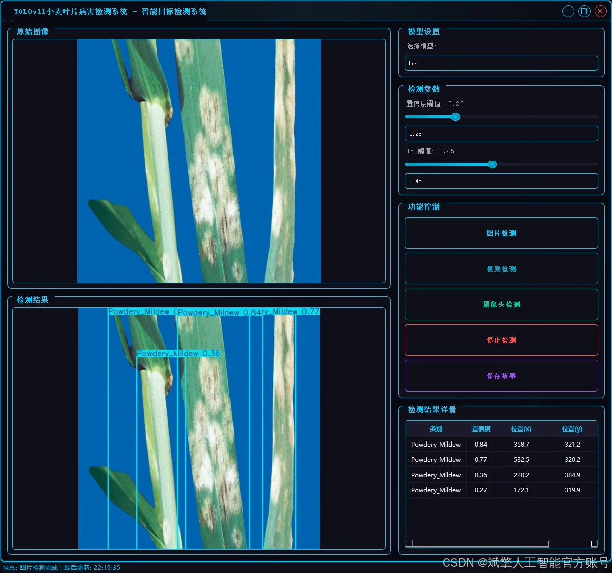
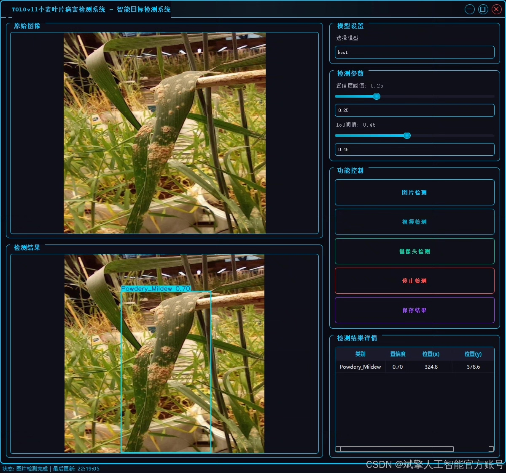
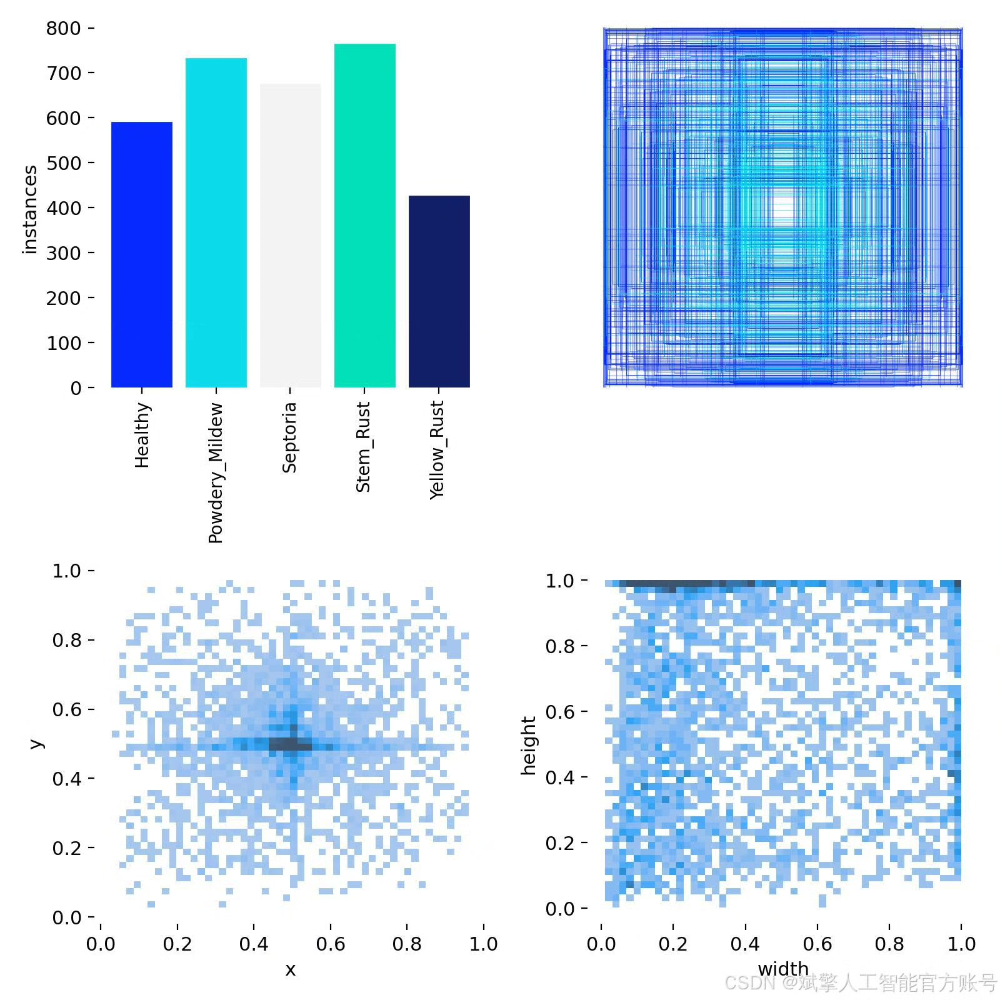
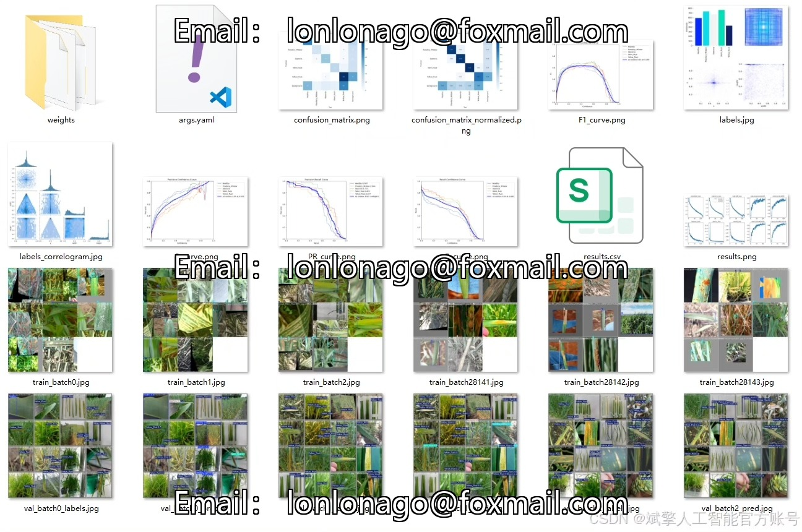
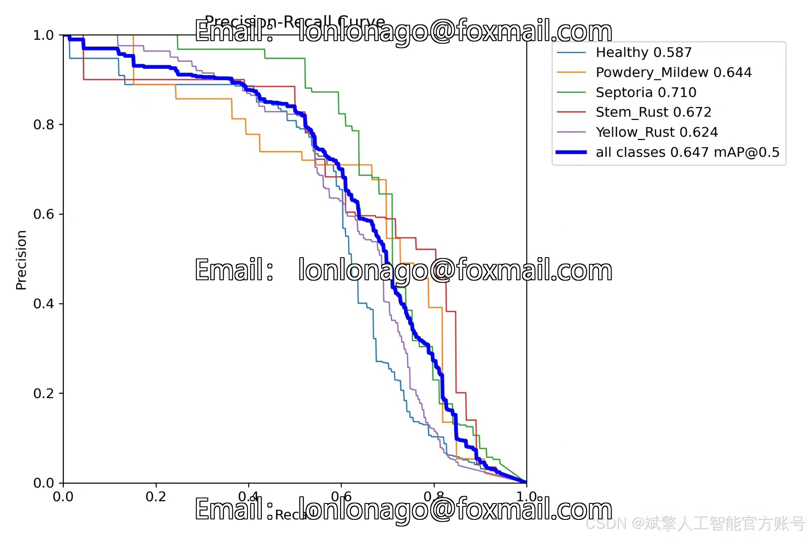
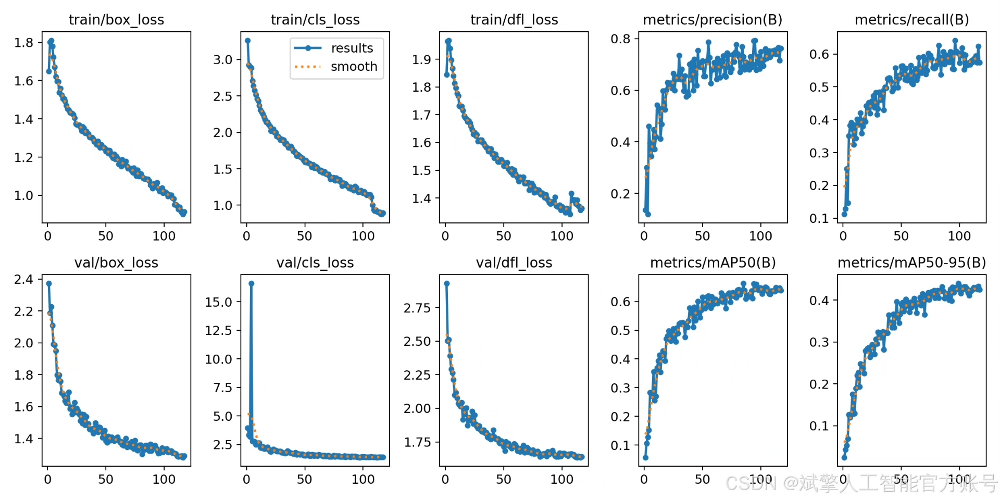
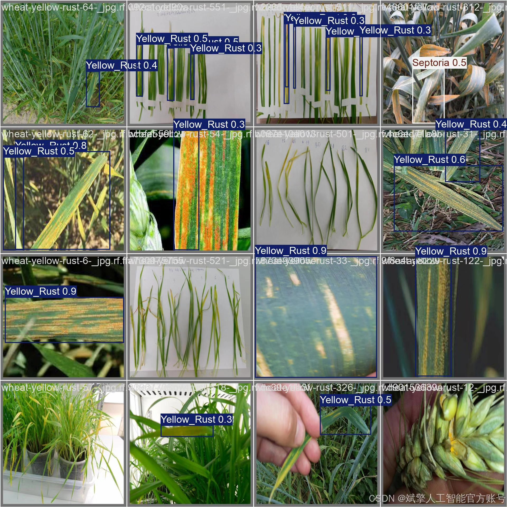

# YOLOv11 Wheat Disease Identification System

## Body

YOLOv11 Wheat Disease Identification System based on Deep Learning YOLOv11: A wheat leaf disease identification detection system (YOLOv11+YOLO dataset + UI interface + login registration interface + Python project source code + model)

nc: 5 classes,
Names: ['Healthy', 'Powdery Mildew', 'Septoria', 'Stem Rust', 'Yellow Rust'],
Dataset quantity: training set 2100 images, validation set 366 images, test set 138 images.

✅ User Login and Registration: Support password detection and security verification.

✅ Three detection modes: Based on the YOLOv11 model, support image, video, and real-time camera three detection, accurate recognition of targets.

✅ Dual-screen comparison: Display original images and detection results in the same screen.

✅ Data visualization: Real-time table displaying the category, confidence, and coordinates of detected targets.

✅ Intelligent parameter adjustment: Provide a confidence slide bar to dynamically optimize detection accuracy, adapting to different scene requirements.

✅ Sci-fi style interactive interface: Dark theme combined with dynamic light effects, reducing visual fatigue and improving operational experience.

## Images

## Payment

Here is a pay link on Stripe ( https://buy.stripe.com/3cs8yP7sY87d0vu9AB ). Please contact me lonlonago@foxmail.com after funding $89, and I will send you a complete data files , thank you!

